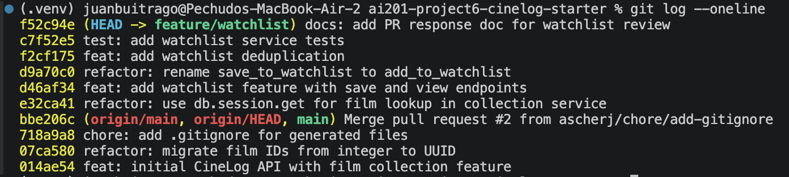

# PR Response Doc — CineLog Watchlist Feature

This document records my responses to @dev-lead's six review comments on the
watchlist PR: what I changed, why, and my reasoning on the two design questions.

## AI Usage
I used an AI assistant (Claude Code) for orientation, mechanical code changes, and commit
hygiene — not for the design decisions:
- **Orientation:** summarizing how `add_to_collection()`, the collection service, and the
  existing test structure work before I read the review comments, and confirming what the
  `main` refactor changed.
- **Comments 1–3 (code):** implementing the rename, the deduplication (error + constraint +
  route handling), and the watchlist tests, following the collection service's existing
  patterns.
- **Comments 4 & 5 (design):** these decisions and their reasoning are mine. I wrote my
  positions first (public-by-default-with-control; keep alphabetical sort), and the AI turned
  my bullet points into prose — it did not choose the positions. I then asked it to act as a
  devil's advocate: *"what counterargument would a careful reviewer raise, and what tradeoff
  am I not acknowledging?"* It surfaced, among others, that my Comment 4 control is
  create-time only (no way to change visibility after adding) and that my own `?sort=`
  proposal in Comment 5 could be turned into an argument for making the *default* sort
  consistent. I reviewed these and kept both positions, because my responses already engage
  them directly — Comment 4 names an after-creation visibility toggle as the honest follow-up,
  and Comment 5 offers `?sort=` as a documented compromise while defending the per-list
  default. The counterarguments sharpened how I framed the tradeoffs but did not change my
  decisions.
- **Comment 6 (rebase) + history rewrite:** resolving the `models.py`/`.gitignore` conflicts
  and shaping the commits into conventional format.
- **Verification:** I verified all AI output against the actual code and the passing test
  suite (10 tests) plus an end-to-end run of the endpoints.

## Comment 1 — Rename
**What I did:**
Renamed `save_to_watchlist()` to `add_to_watchlist()` in `services/watchlist_service.py`,
and updated the import and call site in `routes/watchlist/watchlist.py`.

The project's `verb_to_noun` naming convention (CONTRIBUTING.md) is already established
by the collection service: `add_to_collection()`, `remove_from_collection()`,
`get_collection()`. `save_to_watchlist` broke that pattern with a different verb (`save`)
for the same conceptual operation (adding an entry to a list). `add_to_watchlist` makes
the watchlist API read as a parallel of the collection API, which is what a reviewer and a
future contributor expect.

**How I verified:**
`grep -rn save_to_watchlist` returns nothing (no stale references). `pytest tests/` passes.

## Comment 2 — Deduplication
**What I did:**
Watchlist adds had no duplicate protection — calling add twice created two identical rows.
The collection service already solved this exact problem, so I followed its pattern rather
than inventing a new one:
- Added `AlreadyInWatchlistError` to `services/watchlist_service.py` (parallel to
  `AlreadyInCollectionError`).
- `add_to_watchlist()` now checks for an existing `(user_id, film_id)` entry before insert
  and raises `AlreadyInWatchlistError` if one exists.
- Added a `UniqueConstraint("user_id", "film_id", name="unique_user_film_watchlist")` to
  `WatchlistEntry` — a DB-level guarantee behind the application check, mirroring
  `CollectionEntry`.
- The `POST /watchlist/<user_id>/add` route now returns **409 Conflict** on
  `AlreadyInWatchlistError`. While here I also wired up the **404** handler for
  `FilmNotFoundError`, which the route imported but never actually caught (it would have
  surfaced as a 500).

**How I verified:**
`test_add_to_watchlist_duplicate_raises` asserts the second add raises and that exactly one
row exists. `pytest tests/` passes.

## Comment 3 — Missing test
**What I did:**
Added `tests/test_watchlist.py` following the structure of `tests/test_collection.py` and
CONTRIBUTING.md's requirement (happy path / duplicate / nonexistent ID) for any new service
function. Reused the same `app`, `sample_user`, and `sample_film` fixtures so tests stay
type-agnostic across the UUID migration:
- `test_add_to_watchlist_creates_entry` — happy path, verifies persistence.
- `test_add_to_watchlist_duplicate_raises` — expects `AlreadyInWatchlistError`, confirms one row.
- `test_add_to_watchlist_nonexistent_film_raises` — expects `FilmNotFoundError`.

**How I verified:**
`pytest tests/` → 7 passed (4 collection + 3 watchlist).

## Comment 4 — Default visibility
**My position:**
Keep the default **public** (`public=True`), but make visibility something the user
actually controls: the `POST /watchlist/<user_id>/add` endpoint now accepts an optional
`"public"` field in the body, so a user can add an entry as private (`false`) at add time.
The default only applies when the user doesn't say otherwise.

**Reasoning:**
The whole point of CineLog is to be a *community* film app, not a private movie list. If a
watchlist defaulted to private, no watchlist information would be shared between users by
default, and the community/discovery side of the product effectively disappears — it would
just be a personal list. Defaulting to public is what makes the community feature real: you
can see what films other people are planning to watch. This is also why I don't think the
watchlist should follow the collection's *implicit* privacy — the collection is a personal
log of what you've already watched, whereas the watchlist ("what I intend to watch") is the
part that's actually interesting to share in a community.

But the reviewer is right that a hardcoded public default with no way to change it is a
problem. The real requirement isn't "public vs private" — it's that **the user decides**.
So I kept the community-friendly default and added the ability to override it per entry.
That's the piece the original code was missing: it had a `public` column but no path for a
user to set it.

**Tradeoff acknowledged:**
Any public-by-default choice means a user who never touches the setting is sharing by
default, and some users will be uncomfortable that information is exposed without an explicit
opt-in. I'm accepting that tradeoff because opt-out (with a real, working control) preserves
the community value, whereas private-by-default would protect those users but gut the feature
for everyone. If CineLog later adds account-level privacy expectations (or regulatory
concerns), the honest follow-up is a *per-user default* setting and a PATCH endpoint to
toggle visibility after creation — not flipping this single default.

## Comment 5 — Sort order
**My position:**
Keep the watchlist sorted **alphabetically by title** (`Film.title.asc()`). I'm pushing back
on changing it to newest-first.

**Reasoning:**
The collection and the watchlist look similar but serve different jobs, and the sort should
follow the job:
- The **collection** is a record of films a user has *already watched*. Recency is
  meaningful there — "what did I watch recently?" is a real question — so newest-first is the
  right default.
- The **watchlist** is a holding list of films a user *intends to watch someday*. The date
  you added a film doesn't carry meaning here; what matters is that the film is on the list
  and that you can find it again later. When a user comes back to their watchlist, the task
  is usually "I want to pick something to watch" or "is film X already on here?" — and
  alphabetical order makes scanning for a specific title easy. Newest-first would bury older
  entries a user is just as likely to want.

**Engagement with reviewer's point:**
The reviewer's argument is consistency — both list endpoints should behave the same way, and
alphabetical is surprising next to the collection's newest-first. I agree consistency
matters, but I'd argue the meaningful consistency here is "each list is sorted for how it's
actually used," not "both lists use the identical ORDER BY." Forcing the watchlist to sort
by date to match the collection would make the two endpoints *look* consistent while making
the watchlist *worse* at its actual job. Two features with different purposes having
different, purpose-appropriate defaults isn't an inconsistency to me — it's the sort being
intentional rather than copy-pasted.

If we want to remove the surprise entirely, the clean compromise is to add an optional
`?sort=` query parameter to **both** endpoints (e.g. `?sort=title` / `?sort=date`), each
keeping the default that fits its purpose. That gives us consistent, documented *behavior*
(same knob on both) without giving up the sensible per-list default. I've left that out of
this PR to keep it focused, but I'm happy to add it as a follow-up if you'd prefer the
explicit-control route over the defend-the-default route.

## Comment 6 — Rebase
**What conflicted:**
While the PR was open, `main` merged a refactor (`refactor: migrate film IDs from integer
to UUID`) plus a `chore: add .gitignore`. Rebasing `feature/watchlist` onto the updated
`main` produced two conflicts:
1. **`models.py` (content conflict).** `main` had changed `Film.id` and
   `CollectionEntry.film_id` from `Integer` to `String(36)` (UUID). My branch still had them
   as `Integer` and had also added a new `WatchlistEntry` model with `film_id = db.Integer`.
2. **`.gitignore` (add/add conflict).** Both `main` and my branch added a `.gitignore`. Mine
   was the 8-line version from the project setup; `main`'s was nearly identical but also
   ignored `.pytest_cache/`.

**How I resolved it:**
- `models.py`: took `main`'s UUID definitions for `Film.id` and `CollectionEntry.film_id`,
  kept my additions (`Film.watchlist_entries` relationship and the `WatchlistEntry` model),
  and **extended the UUID migration into my new model** — changed `WatchlistEntry.film_id`
  from `db.Integer` to `db.String(36)` so the new table is consistent with the migrated
  schema. (My `watchlist_service.py` and route already documented `film_id` as a UUID, so no
  further edits were needed there.)
- `.gitignore`: kept `main`'s version (a superset that also ignores `.pytest_cache/`) and
  dropped my redundant copy, so the branch adds nothing to a file `main` already owns.

I rebased rather than merged, so the final branch has a **linear history with no merge
commits** (per CONTRIBUTING.md's "No Merge Commits" rule).

**How I verified no conflict remains:**
- `grep` for conflict markers (`<<<<<<<` / `=======` / `>>>>>>>`) across the tree → none.
- `git rebase --continue` completed cleanly.
- `pytest tests/` → 10 passed against the migrated UUID models.
- End-to-end check via the Flask test client: add → 201, duplicate → 409, `public: false`
  honored, nonexistent film → 404, missing body → 400, `GET` returns titles A→Z.
- `git log --merges origin/main..HEAD` is empty (0 merge commits); `git log --oneline`
  shows a clean linear history.

## Commit History

Final `git log --oneline origin/main..HEAD` — 6 commits, conventional format, no
merge commits (screenshot below):

```
docs: add PR response doc for watchlist review
test: add watchlist service tests
feat: add watchlist deduplication
refactor: rename save_to_watchlist to add_to_watchlist
feat: add watchlist feature with save and view endpoints
refactor: use db.session.get for film lookup in collection service
```



## PR Description

### What this feature does
Adds a **watchlist** to CineLog: a per-user list of films a user intends to watch (distinct
from the collection, which logs films already watched). It exposes two endpoints —
`GET /watchlist/<user_id>` to view a user's watchlist and `POST /watchlist/<user_id>/add` to
add a film — with duplicate protection and per-entry visibility control.

### Endpoints
| Method | Endpoint | Description |
|--------|----------|-------------|
| GET | `/watchlist/<user_id>` | Return the user's watchlist, sorted alphabetically by title |
| POST | `/watchlist/<user_id>/add` | Add a film. Body: `{ "film_id": "<uuid>", "public": true }` (`public` optional, defaults to `true`) |

Status codes: `201` created, `400` missing `film_id`, `404` film not found, `409` already
on the watchlist.

### Design decisions
- **Visibility defaults to public, but is user-controlled.** New entries default to `public`
  (CineLog is a community app; sharing intended viewing is the point), but the add request
  accepts an optional `"public": false` so users can opt out per entry. See Comment 4.
- **Watchlist is sorted alphabetically, not newest-first.** A watchlist is a lookup list of
  intended viewing where findability by title matters more than recency, unlike the
  date-ordered collection. See Comment 5.
- **Deduplication mirrors the collection service** — application-level check plus a
  `UniqueConstraint(user_id, film_id)`.
- While adding tests I found and fixed a latent bug: `WatchlistEntry` had no relationship to
  `Film`, so `get_watchlist()` would raise `AttributeError` on any non-empty list. Added the
  `Film.watchlist_entries` relationship.

### How to manually test end to end
The films catalog is read-only (no create endpoint), so first seed a user and two films:

```bash
python app.py   # in one terminal, serves http://127.0.0.1:5000

# in another terminal — create a user + films and print their IDs
python -c "
from app import create_app, db
from models import User, Film
app = create_app(); ctx = app.app_context(); ctx.push()
u = User(username='ana', email='ana@example.com')
f1 = Film(title='Heat', year=1995); f2 = Film(title='Amelie', year=2001)
db.session.add_all([u, f1, f2]); db.session.commit()
print('USER', u.id); print('FILM1', f1.id); print('FILM2', f2.id)
"
```

Then exercise the endpoints (substitute the printed IDs):

```bash
# Add a film -> 201
curl -i -X POST localhost:5000/watchlist/<USER>/add \
  -H 'Content-Type: application/json' -d '{"film_id":"<FILM1>"}'

# Add the same film again -> 409 Conflict (dedup)
curl -i -X POST localhost:5000/watchlist/<USER>/add \
  -H 'Content-Type: application/json' -d '{"film_id":"<FILM1>"}'

# Add a second film as private -> 201, response shows "public": false
curl -i -X POST localhost:5000/watchlist/<USER>/add \
  -H 'Content-Type: application/json' -d '{"film_id":"<FILM2>","public":false}'

# Nonexistent film -> 404
curl -i -X POST localhost:5000/watchlist/<USER>/add \
  -H 'Content-Type: application/json' -d '{"film_id":"no-such-uuid"}'

# View watchlist -> films sorted A->Z (Amelie before Heat)
curl -i localhost:5000/watchlist/<USER>
```
